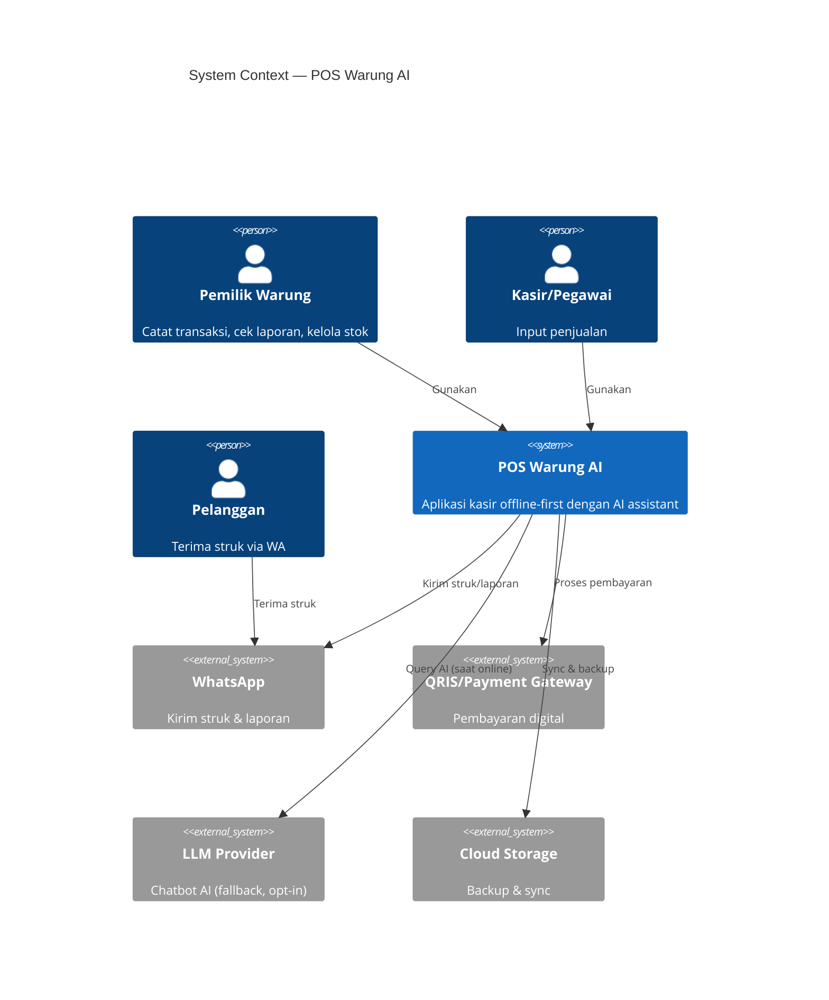
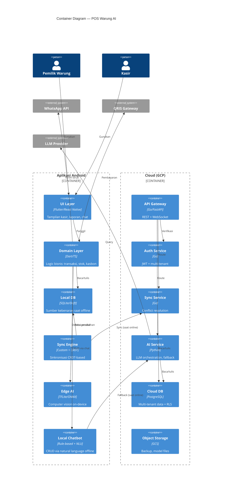

# POS Warung AI — Master Context untuk Agentic AI

> **Dokumen ini adalah konteks utama untuk agentic AI (Roo Code / Cline) dalam mengerjakan proyek POS Warung AI.**
> Format: R-T-F-C (Role, Task, Format, Context)
> Standar: arc42 + C4 Model + ADR (Nygard) + ISO/IEC/IEEE 42010:2011

---

## 0. Instruksi untuk Agentic AI

**Role:** Kamu adalah **Senior Cloud & DevOps Architect** sekaligus **Senior Software Architect** dengan spesialisasi:
- Offline-first mobile architecture
- Distributed systems & CRDT
- Edge AI / TinyML
- Modular monolith & Domain-Driven Design
- Multi-tenant SaaS architecture
- Cloud-native deployment (GCP)

**Task:** Bantu user membangun **POS Warung AI** — aplikasi POS offline-first dengan AI assistant untuk warung kecil Indonesia, yang dirancang untuk berkembang menjadi SaaS.

**Format output:**
- Selalu rujuk ADR yang relevan sebelum mengambil keputusan
- Setiap keputusan arsitektur baru → buat ADR baru dengan format Nygard
- Dokumentasi mengikuti arc42 + C4 Model
- Kode mengikuti prinsip Clean Architecture + DDD
- Selalu pertimbangkan offline-first sebagai constraint utama

**Context:** Baca seluruh dokumen ini sebelum memulai task apa pun.

**Aturan penting:**
1. **Jangan** menambah dependensi cloud-only tanpa ADR baru
2. **Jangan** mengorbankan offline-first untuk kemudahan development
3. **Selalu** tulis ADR untuk keputusan arsitektur signifikan
4. **Selalu** pertimbangkan HP RAM 2GB sebagai target minimum
5. **Selalu** jaga boundary antar-modul (Modular Monolith)
6. **Selalu** gunakan tenant_id + RLS untuk data multi-tenant
7. **Jangan** pakai microservices tanpa persetujuan user
8. **Selalu** dokumentasikan trade-off, bukan hanya solusi

---

## 1. Ringkasan Proyek

### 1.1 Tujuan

Membangun **POS Warung AI** — aplikasi Point of Sale untuk warung kecil Indonesia dengan karakteristik:
- **Offline-first** — 100% berfungsi tanpa internet
- **AI-powered** — computer vision untuk produk tanpa barcode, chatbot CRUD natural language
- **Terjangkau** — target harga mikro (Rp10.000–20.000/bulan)
- **Privasi** — data milik pengguna, tidak dijual ke pihak ketiga
- **Ringan** — jalan di HP Android RAM 2GB

### 1.2 Tahapan Pengembangan

| Tahap | Target | Deliverable |
|---|---|---|
| **Fase 1** | Aplikasi pribadi untuk warung sendiri | MVP offline-first, transaksi, stok, kasbon |
| **Fase 2** | Portofolio | Dokumentasi arsitektur, ADR, C4 diagram, README enterprise |
| **Fase 3** | SaaS | Multi-tenant, AI fitur, onboarding self-service |

### 1.3 Positioning

> **"POS offline-first untuk warung Indonesia: gratis, ringan, tanpa batas produk, data milik Anda, dan bisa dipakai tanpa internet."**

Diferensiasi:
- Offline-first sejati (bukan "offline mode" palsu)
- AI yang paham konteks warung (bukan resto/retail menengah)
- Harga mikro
- Privasi terjamin

---

## 2. Tech Stack

| Layer | Teknologi | Alasan |
|---|---|---|
| **Mobile** | Flutter atau React Native | Cross-platform, familiar |
| **Local DB** | SQLite + Drift (Flutter) / WatermelonDB (RN) | Offline-first, mature |
| **Sync** | CRDT (Automerge / Yjs) | Conflict-free |
| **Edge AI** | TFLite / ONNX Runtime Mobile | On-device inference |
| **Chatbot Lokal** | Rasa NLU / custom rule-based | Offline CRUD |
| **Backend** | Go (Fiber/Echo) atau Python (FastAPI) | Performa + familiar |
| **Cloud DB** | PostgreSQL 14+ (Cloud SQL) | RLS support |
| **Cloud Runtime** | GCP Cloud Run | Serverless, murah |
| **Object Storage** | GCS | Backup, model files |
| **Queue** | Pub/Sub | Async sync |
| **LLM Fallback** | Gemini Flash / Claude Haiku | Murah, cepat |
| **CI/CD** | GitHub Actions | Familiar |
| **Container** | Docker + Docker Compose | Lokal & cloud identik |
| **Observability** | OpenTelemetry + Cloud Logging | Standar |
| **Diagram** | Mermaid + Draw.io | Portofolio |

---

## 3. Architectural Drivers

### 3.1 Functional Requirements

| ID | Requirement | Prioritas | Fase |
|---|---|---|---|
| FR-01 | Catat transaksi penjualan | Wajib | 1 |
| FR-02 | Kelola produk & stok | Wajib | 1 |
| FR-03 | Kasbon / utang pelanggan | Wajib | 1 |
| FR-04 | Laporan harian/bulanan | Wajib | 1 |
| FR-05 | AI: deteksi produk via kamera | Diferensiasi | 2 |
| FR-06 | AI: chatbot CRUD natural language | Diferensiasi | 2 |
| FR-07 | Multi-outlet | Future | 3 |
| FR-08 | Sinkronisasi antar perangkat | Future | 2 |
| FR-09 | Multi-tenant SaaS | Future | 3 |
| FR-10 | Integrasi WhatsApp untuk struk | Nice-to-have | 2 |
| FR-11 | QRIS payment | Nice-to-have | 2 |

### 3.2 Quality Attributes

| ID | Attribute | Target | Sumber |
|---|---|---|---|
| QA-01 | Offline-first | 100% fungsi inti tanpa internet | Pothineni (2024) |
| QA-02 | Performance | Transaksi < 500ms di HP RAM 2GB | IEEE Xplore (2026) |
| QA-03 | Availability | Tetap jalan saat cloud down | Kleppmann et al. (2019) |
| QA-04 | Privacy | Data tidak dijual ke pihak ketiga | GDPR spirit |
| QA-05 | Cost | Cloud cost < Rp5.000/user/bulan | GCP Architecture Framework |
| QA-06 | Scalability | 10.000 warung tanpa redesign | Back4App (2026) |
| QA-07 | Maintainability | Modular monolith, boundary jelas | Su & Li (2024) |
| QA-08 | Security | JWT + RLS + SQLCipher | OWASP MASVS |
| QA-09 | Portability | Android-first, iOS later | Constraint |
| QA-10 | Observability | Structured logging + metrics | OpenTelemetry |

### 3.3 Constraints

| ID | Constraint | Implikasi |
|---|---|---|
| C-01 | Android-first | Flutter/RN, bukan native iOS dulu |
| C-02 | Tim 1 orang | Hindari microservices, hindari kompleksitas |
| C-03 | Budget cloud minimal | GCP free tier dulu, Cloud Run |
| C-04 | Tech stack familiar | Go/Python, React/Next.js, Docker |
| C-05 | HP target RAM 2GB | Model AI < 10MB, app < 50MB |
| C-06 | Sinyal tidak stabil | Offline-first wajib |
| C-07 | Regulasi Indonesia | Data lokal prioritas, QRIS support |

---

## 4. C4 Model

### 4.1 Level 1: System Context



**Keputusan kunci:**
- AI harus bisa jalan **tanpa LLM cloud** (on-device)
- WhatsApp jadi channel utama, bukan email
- Cloud opsional, bukan wajib

### 4.2 Level 2: Container



### 4.3 Level 3: Component (Priority)

**Akan dibuat untuk:**
1. **Sync Engine** — detail CRDT, vector clock, conflict resolution
2. **Edge AI** — pipeline computer vision on-device
3. **Chatbot** — hybrid local + cloud routing

*Status: TBD (next task)*

---

## 5. Architecture Decision Records (ADR)

### ADR-001: Offline-First dengan Local DB sebagai Source of Truth

**Status:** Accepted — 2026-09-10

**Context:**
Warung kecil Indonesia sering menghadapi koneksi internet tidak stabil, mati listrik, HP RAM terbatas (2GB), dan kebutuhan operasional yang tidak bisa menunggu koneksi. Pendekatan cloud-first gagal di konteks ini.

**Literatur:**
- Pothineni, S. H. (2024). "Offline-First Mobile Architecture." *JAIGS*.
- Kleppmann, M., et al. (2019). "Local-first software." *ACM Onward!*
- CAMS-F Edge DTN (2026). *Future Internet*, 18(4), 180.
- ISO 9241-210:2019 — Human-Centered Design.

**Decision:**
Local DB (SQLite/Drift) sebagai **source of truth** untuk semua operasi inti. Cloud hanya untuk sync & backup. Aplikasi **100% berfungsi tanpa internet** untuk fitur inti.

**Consequences:**
- ✅ Warung tetap operasional saat offline
- ✅ UX responsif (< 500ms)
- ✅ Privasi lebih baik
- ✅ Cloud cost rendah
- ❌ Kompleksitas sinkronisasi meningkat
- ❌ Butuh CRDT (ADR-002)
- ❌ Ukuran aplikasi lebih besar

**Alternatif ditolak:**
- Cloud-first dengan cache
- Hybrid dengan cloud sebagai primary
- PWA dengan IndexedDB (terbatas di Android)

---

### ADR-002: CRDT untuk Sync, bukan Last-Write-Wins

**Status:** Accepted — 2026-09-10

**Context:**
Dengan offline-first (ADR-001), muncul masalah conflict resolution saat dua perangkat mengubah data yang sama. LWW menghilangkan data — tidak acceptable untuk transaksi.

**Literatur:**
- Shapiro, M., et al. (2011). "Conflict-free Replicated Data Types." *SSS 2011*.
- IEEE TSE (2025). "Consistent Local-First Software." Vol. 51, Issue 1.
- ConflictSync (2026). *ACM Digital Library*.

**Decision:**
Gunakan **CRDT** untuk sinkronisasi:

| Data | CRDT Type |
|---|---|
| Stok produk | PN-Counter |
| Daftar transaksi | G-Set |
| Kasbon pelanggan | PN-Counter per pelanggan |
| Profil produk | LWW-Register |
| Laporan | Computed (bukan CRDT) |

Implementasi: **Automerge** atau **Yjs**.

**Consequences:**
- ✅ Conflict resolution otomatis, tanpa data loss
- ✅ Matematis terjamin
- ✅ Peer-to-peer friendly
- ❌ Kompleksitas implementasi tinggi
- ❌ Overhead metadata
- ❌ Debugging lebih sulit

**Alternatif ditolak:**
- Last-Write-Wins
- Vector Clock + manual resolution
- Operational Transformation (butuh server terpusat)

---

### ADR-003: On-Device AI untuk Computer Vision

**Status:** Accepted — 2026-09-10

**Context:**
Fitur diferensiasi: deteksi produk tanpa barcode. Cloud vision bermasalah: butuh internet, latency tinggi, mahal, privasi buruk.

**Literatur:**
- Somvanshi, S., et al. (2025). "From TinyML to TinyDL." *ACM Computing Surveys*.
- Cordova-Cardenas, R., et al. "Edge AI in Practice." *MDPI Sensors*.
- IEEE Xplore (2026). "Compact Edge-AI Architecture."
- QuantEdge (2025). *IEEE Xplore*.

**Decision:**
On-device AI dengan spesifikasi:
- Runtime: TFLite / ONNX Runtime Mobile
- Model: MobileNetV3 / EfficientNet-Lite / YOLOv8-nano
- Ukuran: < 10MB (INT8 quantized)
- Input: 224×224 atau 320×320
- Fallback: manual jika confidence < 70%
- Target akurasi: 85% untuk 50 produk populer

**Consequences:**
- ✅ 100% offline
- ✅ Latency < 500ms
- ✅ Privasi terjaga
- ✅ Biaya marginal nol
- ❌ Akurasi terbatas
- ❌ Ukuran app +10MB
- ❌ Update model butuh download

**Alternatif ditolak:**
- Cloud Vision API
- Hybrid on-device + cloud
- Barcode-only
- RFID/NFC

---

### ADR-004: Hybrid Chatbot (Local + Cloud LLM)

**Status:** Accepted — 2026-09-10

**Context:**
Fitur diferensiasi: chatbot CRUD via natural language. LLM cloud butuh internet, mahal, bisa halusinasi (berbahaya untuk data bisnis).

**Literatur:**
- GaryAI (2025). *IEEE Xplore*.
- HNLP-RBV (2026). *IEEE ICCMSO*.
- Hybrid Chatbot for E-Commerce (2026). *IEEE Xplore*.
- ACL Anthology — Harel Statecharts + LLMs.

**Decision:**
Arsitektur hybrid dua lapis:

**Lapisan 1 — Local (Offline):**
- Rule-based parser untuk perintah umum
- NLU ringan (intent + slot)
- Harel Statecharts untuk dialog
- Coverage: ~80%

**Lapisan 2 — Cloud (Online, opt-in):**
- LLM (Gemini Flash / Claude Haiku)
- Function calling ke API internal
- Rule-based validation sebelum eksekusi
- Coverage: ~20%

**Prinsip:** LLM **tidak pernah** langsung mengubah data. LLM hanya menghasilkan intent + parameters, divalidasi rule-based layer.

**Consequences:**
- ✅ Offline untuk perintah umum
- ✅ Biaya LLM rendah
- ✅ Mencegah halusinasi
- ❌ Dua jalur kode
- ❌ Butuh training NLU
- ❌ Konsistensi response

**Alternatif ditolak:**
- Full LLM cloud
- Full rule-based
- On-device LLM (> 1GB)

---

### ADR-005: Modular Monolith, bukan Microservices

**Status:** Accepted — 2026-09-10

**Context:**
Tim 1 orang, target SaaS. Butuh keseimbangan antara simplicity dan scalability.

**Literatur:**
- Su, R., & Li, X. (2024). "Modular Monolith." *SATrends '24, ACM*.
- Krzysztoń & Łatwiński (2025). *Journal of Computer Sciences Institute*, Vol. 34.
- SLR (2025). "Modular Monolith Architecture in Cloud Environments." *Semantic Scholar*.
- Fowler, M. (2014). "Microservices."

**Decision:**
Modular Monolith dengan:
- Satu codebase, satu deployment unit
- Boundary modul jelas (DDD)
- Komunikasi antar-modul via interface
- Database tunggal dengan schema terpisah

**Modul utama:**
1. Sales — transaksi, struk
2. Inventory — produk, stok
3. Customer — pelanggan, kasbon
4. Reporting — laporan, analytics
5. AI — chatbot, computer vision
6. Sync — sinkronisasi CRDT
7. Auth — autentikasi, multi-tenancy

**Consequences:**
- ✅ Development cepat
- ✅ Debugging mudah
- ✅ Biaya infra rendah
- ✅ Bisa di-refactor ke microservices nanti
- ❌ Scaling vertical dulu
- ❌ Coupling risk
- ❌ Build time meningkat

**Alternatif ditolak:**
- Microservices (overkill)
- Monolith tanpa modular
- Serverless functions

---

### ADR-006: Multi-Tenancy dengan Row-Level Security

**Status:** Accepted — 2026-09-10

**Context:**
Target 10.000 warung. Butuh isolasi data + biaya efisien + onboarding cepat.

**Literatur:**
- Cockroach Labs (2025). "You Shall Not Pass: Fine Grained Access Control with RLS."
- Permit.io (2025). "Fine-Grained Postgres Permissions."
- Back4App (2026). "Multi-Tenant Database Architecture."
- django-boundary (2026). *PyPI*.
- entwickler.de (2026). "PostgreSQL RLS."

**Decision:**
RLS di PostgreSQL:
- Satu database untuk semua tenant
- Kolom `tenant_id` di setiap tabel
- RLS policy filter berdasarkan `tenant_id` dari JWT
- Role `app_user` dengan akses terbatas
- Audit log untuk akses sensitif

```sql
CREATE POLICY tenant_isolation ON products
  USING (tenant_id = current_setting('app.current_tenant')::uuid);
```

**Consequences:**
- ✅ Biaya rendah
- ✅ Onboarding cepat
- ✅ Backup terpusat
- ❌ Risiko kebocoran jika salah konfigurasi
- ❌ Performa menurun dengan data besar
- ❌ Butuh disiplin developer

**Alternatif ditolak:**
- Database per tenant (mahal)
- Schema per tenant (kompleks)
- Application-level filtering (rawan error)

---

### ADR-007: Deployment dengan GCP Cloud Run

**Status:** Accepted — 2026-09-10

**Context:**
Butuh deployment yang murah, auto-scale, dan identik dengan lokal.

**Literatur:**
- ScienceDirect (2025). "Containerization in multi-cloud environment."
- Wiley (2026). "Scaling Smarter: Cloud-Native Software Engineering."
- Google Cloud Architecture Framework.

**Decision:**
- Cloud Run untuk semua service
- Cloud SQL PostgreSQL dengan RLS
- GCS untuk backup & model files
- Pub/Sub untuk async sync queue
- Docker Compose untuk lokal (identik dengan cloud)

**Consequences:**
- ✅ Serverless, auto-scale
- ✅ Murah (pay-per-use)
- ✅ Identik lokal & cloud
- ❌ Cold start
- ❌ Vendor lock-in (GCP)

---

### ADR-008: Security dengan JWT + SQLCipher + RLS

**Status:** Accepted — 2026-09-10

**Literatur:**
- Duende Software (2025). "JWT Best Practices."
- Codecentric (2025). "Self-issued JWT for mobile client authentication."
- OWASP MASVS.
- RFC 7519 (JWT).

**Decision:**
- JWT untuk auth (ECDSA-signed untuk mobile)
- SQLCipher untuk enkripsi lokal
- RLS untuk isolasi tenant
- HTTPS untuk semua komunikasi
- Secrets di GCP Secret Manager

---

### ADR-009: Observability dengan OpenTelemetry

**Status:** Accepted — 2026-09-10

**Literatur:**
- Microsoft Azure Well-Architected Framework (2026).
- Cândido et al. "Log-based software monitoring." *PeerJ CS*.
- OpenTelemetry (CNCF).

**Decision:**
- Structured logging (JSON)
- Metrics via OpenTelemetry
- Traces untuk sync & AI
- Health check endpoint
- Alerting via Cloud Monitoring

---

### ADR-010: Dokumentasi dengan arc42 + C4 + ADR

**Status:** Accepted — 2026-09-10

**Literatur:**
- Starke, G., & Hruschka, P. (2005). arc42.
- Brown, S. (2018). C4 Model.
- Nygard, M. (2011). "Documenting Architecture Decisions."
- ISO/IEC/IEEE 42010:2011.

**Decision:**
- arc42 untuk dokumentasi arsitektur
- C4 Model untuk diagram
- ADR (Nygard format) untuk keputusan
- Semua di `docs/` folder

---

## 6. Deployment View

### 6.1 Lokal (Development)

```
┌─────────────────────────────────────┐
│  Laptop Developer                    │
│  ┌─────────────┐  ┌──────────────┐  │
│  │ Android     │  │ Docker       │  │
│  │ Emulator    │  │ Compose      │  │
│  │             │  │              │  │
│  │ - App       │  │ - API        │  │
│  │ - SQLite    │  │ - PostgreSQL │  │
│  │ - Edge AI   │  │ - Redis      │  │
│  └─────────────┘  └──────────────┘  │
└─────────────────────────────────────┘
```

### 6.2 Cloud (Production)

```
┌──────────────────────────────────────────────┐
│  GCP                                          │
│  ┌────────────┐  ┌────────────┐  ┌────────┐ │
│  │ Cloud Run  │  │ Cloud Run  │  │ Cloud  │ │
│  │ API Gateway│  │ Sync Svc   │  │ SQL    │ │
│  └────────────┘  └────────────┘  └────────┘ │
│  ┌────────────┐  ┌────────────┐  ┌────────┐ │
│  │ Cloud Run  │  │ GCS        │  │ Pub/Sub│ │
│  │ AI Service │  │ (backup)   │  │ (queue)│ │
│  └────────────┘  └────────────┘  └────────┘ │
└──────────────────────────────────────────────┘
         ▲
         │ HTTPS/WebSocket
         │
┌────────┴────────┐
│  Android App    │
│  (offline-first)│
└─────────────────┘
```

**Prinsip:**
- Cloud Run untuk semua service (serverless, murah)
- Cloud SQL PostgreSQL dengan RLS
- GCS untuk backup & model files
- Pub/Sub untuk async sync queue
- Local dev pakai Docker Compose

---

## 7. Cross-Cutting Concerns

| Concern | Pendekatan | ADR |
|---|---|---|
| **Offline Sync** | CRDT + vector clock, WebSocket | ADR-002 |
| **AI On-Device** | TFLite, INT8 quantization, < 10MB | ADR-003 |
| **AI Cloud Fallback** | LLM API, rate-limited, opt-in | ADR-004 |
| **Security** | JWT (ECDSA) + SQLCipher + RLS | ADR-008 |
| **Multi-Tenancy** | tenant_id + RLS | ADR-006 |
| **Observability** | OpenTelemetry + Cloud Logging | ADR-009 |
| **CI/CD** | GitHub Actions → Cloud Run | ADR-007 |
| **Privacy** | Data lokal prioritas, cloud opt-in | ADR-001 |
| **Error Handling** | Graceful degradation, offline queue | — |
| **i18n** | Bahasa Indonesia default | — |

---

## 8. Struktur Folder

### 8.1 Root Repository

```
pos-warung-ai/
├── README.md                    # Enterprise README
├── LICENSE                      # MIT / Apache 2.0
├── .gitignore                   # Node, Flutter, Python, Draw.io
├── .env.example
├── docker-compose.yml           # Local dev
├── Makefile                     # Task runner
├── docs/
│   ├── architecture/
│   │   ├── arc42.md             # arc42 ringkas
│   │   ├── c4-context.md
│   │   ├── c4-container.md
│   │   ├── c4-component-sync.md
│   │   ├── c4-component-edgeai.md
│   │   └── c4-component-chatbot.md
│   ├── adr/
│   │   ├── README.md            # Index ADR
│   │   ├── template.md
│   │   ├── 0001-offline-first.md
│   │   ├── 0002-crdt-sync.md
│   │   ├── 0003-on-device-ai.md
│   │   ├── 0004-hybrid-chatbot.md
│   │   ├── 0005-modular-monolith.md
│   │   ├── 0006-multi-tenancy-rls.md
│   │   ├── 0007-deployment-gcp.md
│   │   ├── 0008-security.md
│   │   ├── 0009-observability.md
│   │   └── 0010-documentation.md
│   ├── diagrams/                # Draw.io, Mermaid
│   │   ├── c4-context.drawio
│   │   ├── c4-container.drawio
│   │   └── deployment.drawio
│   └── deployment/
│       ├── local.md
│       ├── cloud.md
│       └── ci-cd.md
├── mobile/                      # Flutter / React Native
│   ├── lib/
│   │   ├── ui/                  # Presentation layer
│   │   ├── domain/              # Domain layer (DDD)
│   │   ├── infrastructure/      # Data, DB, API
│   │   ├── sync/                # CRDT sync engine
│   │   ├── ai/                  # Edge AI
│   │   └── chatbot/             # Local chatbot
│   └── test/
├── backend/                     # Go / Python
│   ├── cmd/
│   ├── internal/
│   │   ├── sales/
│   │   ├── inventory/
│   │   ├── customer/
│   │   ├── reporting/
│   │   ├── ai/
│   │   ├── sync/
│   │   ├── auth/
│   │   └── shared/
│   └── test/
├── infra/
│   ├── terraform/               # GCP infra
│   ├── k8s/                     # (future)
│   └── docker/
└── .github/
    └── workflows/
        ├── mobile-ci.yml
        ├── backend-ci.yml
        └── deploy.yml
```

### 8.2 Git Workflow

- Branch: `main`, `feat/*`, `fix/*`, `docs/*`, `adr/*`
- Commit: Conventional Commits
- PR: wajib review (self-review untuk solo)
- CI: lint, test, build
- CD: deploy ke Cloud Run (staging → production)

### 8.3 Gitignore (Tambahan)

```
# Draw.io cache
*.dtmp
*.bkp

# Flutter
mobile/build/
mobile/.dart_tool/

# Python
__pycache__/
*.pyc
.venv/

# Go
backend/bin/

# Node
node_modules/

# Env
.env
.env.local

# AI models (large files → GCS)
*.tflite
*.onnx
!mobile/assets/models/.gitkeep
```

---

## 9. Roadmap

### Fase 1: MVP Pribadi (Minggu 1–4)

- [ ] Setup repo + struktur folder
- [ ] Docker Compose lokal
- [ ] SQLite schema + Drift (Flutter) / WatermelonDB (RN)
- [ ] Modul Sales (transaksi)
- [ ] Modul Inventory (produk, stok)
- [ ] Modul Customer (kasbon)
- [ ] Laporan harian sederhana
- [ ] Test di HP sendiri

### Fase 2: Portofolio (Minggu 5–8)

- [ ] CRDT sync engine
- [ ] Backend API + Cloud SQL
- [ ] Multi-device sync
- [ ] README enterprise
- [ ] arc42 + C4 diagram lengkap
- [ ] ADR lengkap (10 ADR)
- [ ] CI/CD pipeline
- [ ] Deploy ke Cloud Run
- [ ] Pin repo di GitHub

### Fase 3: AI (Minggu 9–12)

- [ ] Edge AI: dataset + training + TFLite
- [ ] Local chatbot (rule-based + NLU)
- [ ] Cloud LLM fallback
- [ ] Integrasi WhatsApp
- [ ] QRIS payment

### Fase 4: SaaS (Minggu 13+)

- [ ] Multi-tenant RLS
- [ ] Onboarding self-service
- [ ] Billing (Midtrans/Xendit)
- [ ] Landing page
- [ ] Marketing

---

## 10. Checklist untuk Agentic AI

Sebelum memulai task, agent harus:

- [ ] Baca dokumen ini sampai selesai
- [ ] Identifikasi ADR yang relevan
- [ ] Cek apakah task melanggar ADR
- [ ] Jika ya, buat ADR baru sebelum implementasi
- [ ] Dokumentasikan keputusan
- [ ] Tulis test
- [ ] Update dokumentasi
- [ ] Commit dengan Conventional Commits

Setelah task, agent harus:

- [ ] Update ADR jika ada keputusan baru
- [ ] Update C4 diagram jika ada container/component baru
- [ ] Update roadmap
- [ ] Update README jika perlu
- [ ] Pastikan tidak ada regresi offline-first
- [ ] Pastikan tidak ada kebocoran tenant data

---

## 11. Referensi Lengkap

### Buku
- Richards, M., & Ford, N. *Fundamentals of Software Architecture*.
- Ousterhout, J. *Philosophy of Software Design*.
- Evans, E. *Domain-Driven Design*.
- Kleppmann, M. *Designing Data-Intensive Applications*.
- Brown, S. *The C4 Model* (O'Reilly, 2026).

### Paper
- Shapiro et al. (2011). CRDT. *SSS 2011*.
- Kleppmann et al. (2019). Local-first software. *ACM Onward!*.
- Pothineni (2024). Offline-First Mobile Architecture. *JAIGS*.
- Su & Li (2024). Modular Monolith. *SATrends '24, ACM*.
- Somvanshi et al. (2025). TinyML to TinyDL. *ACM Computing Surveys*.
- IEEE TSE (2025). Consistent Local-First Software.
- GaryAI (2025). *IEEE Xplore*.
- HNLP-RBV (2026). *IEEE ICCMSO*.

### Standar
- ISO/IEC/IEEE 42010:2011 — Architecture Description
- ISO 9241-210:2019 — Human-Centered Design
- ISO 56002:2019 — Innovation Management
- RFC 7519 — JWT
- OWASP MASVS — Mobile Security
- OpenTelemetry — Observability
- PostgreSQL RLS — Multi-tenancy

### Framework
- arc42 — Architecture Documentation
- C4 Model — Visualization
- ADR (Nygard) — Decision Records
- GCP Architecture Framework
- Google Cloud Run

### Tools
- Automerge / Yjs — CRDT
- TFLite / ONNX Runtime — Edge AI
- Rasa NLU — Chatbot
- Drift / WatermelonDB — Local DB
- Docker Compose — Local dev
- GitHub Actions — CI/CD

---

## 12. Kontak & Konteks Tambahan

**Proyek:** POS Warung AI
**Owner:** Pemilik warung (sekaligus developer)
**Lokasi:** Indonesia
**Bahasa:** Indonesia (default), English (technical docs)
**Target pasar:** Warung kecil Indonesia (10.000+ warung)
**Model bisnis:** Freemium / mikro-subscription (Rp10.000–20.000/bulan)
**Status:** Fase 0 — Perancangan arsitektur

**Konteks Fiverr:**
- Gig existing: "End-to-End IoT System" ($15 Basic)
- Gig baru (rencana): "Software Architecture Refactoring"
- Portfolio GitHub: 6 repo di-pin
- Positioning: Senior Cloud & DevOps Architect

**Konteks Agentic AI:**
- VS Code + Roo Code / Cline
- Model: Gemini 1.5 Flash / Claude (hindari `openrouter/free`)
- Prompt: R-T-F-C (Role, Task, Format, Context)

---

**Dokumen ini adalah living document. Update setiap ada keputusan arsitektur baru.**

**Versi:** 1.0
**Terakhir diperbarui:** 2026-09-10
**Status:** Draft — siap untuk agentic AI

---

## Lampiran: Template ADR (Nygard)

```markdown
# ADR-XXX: [Judul Keputusan]

## Status
[Proposed | Accepted | Deprecated | Superseded by ADR-XXX]
Tanggal: YYYY-MM-DD

## Context
[Deskripsi masalah, constraint, dan literatur yang relevan]

## Decision
[Keputusan yang diambil]

## Consequences
**Positif:**
- ...

**Negatif:**
- ...

**Mitigasi:**
- ...

## Alternatif yang Ditolak
| Alternatif | Alasan Ditolak |
|---|---|
| ... | ... |

## Referensi
- ...
```

---

**End of Master Context Document**