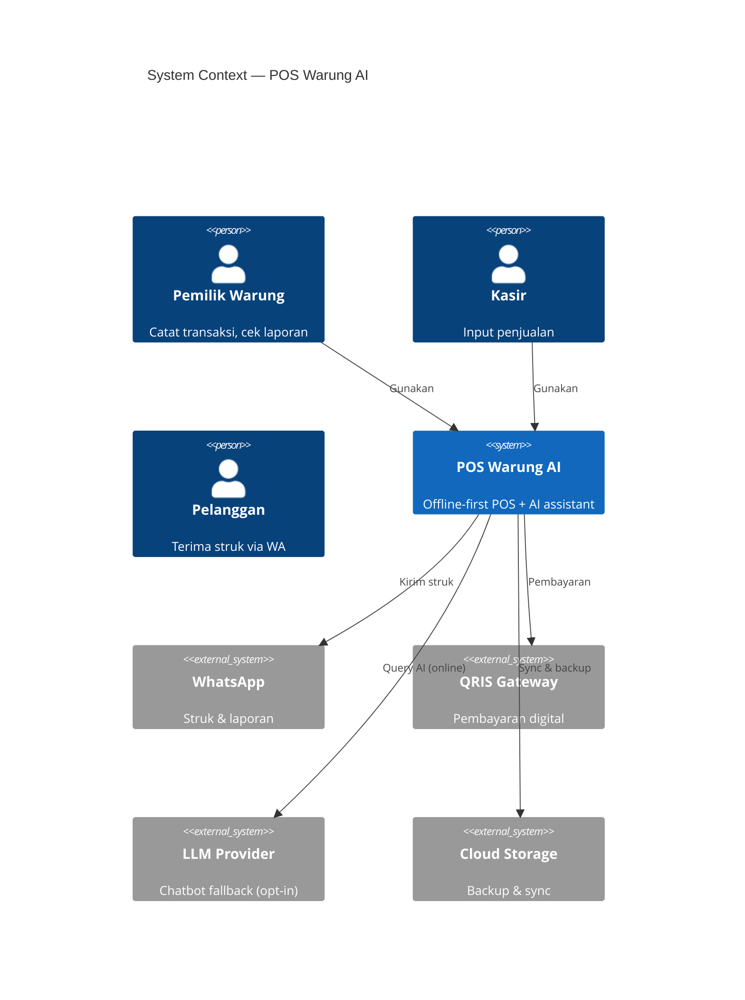
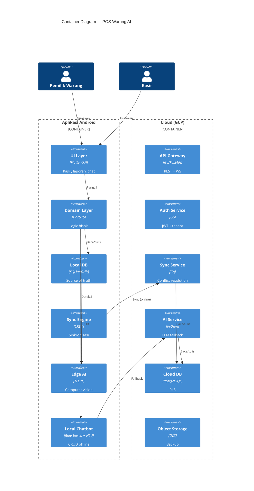

# POS Warung AI

> **Offline-first Point of Sale dengan AI Assistant untuk warung kecil Indonesia.**
> Dirancang untuk berfungsi 100% tanpa internet, ringan di HP RAM 2GB, dan siap berkembang menjadi SaaS multi-tenant.

[]()
[]()
[]()
[]()
[]()
[]()

---

## Daftar Isi

- [Latar Belakang](#latar-belakang)
- [Masalah yang Diselesaikan](#masalah-yang-diselesaikan)
- [Keputusan Arsitektur](#keputusan-arsitektur)
- [Arsitektur Sistem](#arsitektur-sistem)
- [Tech Stack](#tech-stack)
- [Roadmap](#roadmap)
- [Struktur Repositori](#struktur-repositori)
- [Dokumentasi](#dokumentasi)
- [Referensi](#referensi)

---

## Latar Belakang

Warung kecil di Indonesia menghadapi realitas operasional yang jarang tersentuh oleh aplikasi POS modern:

- **Koneksi internet tidak stabil** — banyak warung di area dengan sinyal lemah atau tidak ada
- **Mati listrik** — router mati, cloud tidak bisa diakses
- **HP murah** — mayoritas pakai Android RAM 2GB
- **Produk tanpa barcode** — gorengan, kue, rokok ketengan, produk curah
- **Pencatatan manual** — buku tulis, rawan hilang, sulit dianalisis

Aplikasi POS existing (Majoo, Moka, Pawoon, Olsera, Qasir) dirancang untuk **retail/F&B menengah**, bukan warung. Mereka:

- Cloud-first → tidak jalan saat offline
- Kompleks → butuh training
- Mahal → Rp99.000–999.000/bulan
- Fitur tidak relevan → meja resto, kitchen order, multi-outlet

**POS Warung AI** hadir untuk mengisi celah ini: offline-first, ringan, terjangkau, dan dengan AI yang benar-benar paham konteks warung.

---

## Masalah yang Diselesaikan

Setiap keputusan arsitektur di proyek ini lahir dari masalah nyata. Berikut peta masalah → solusi → bukti.

### Masalah 1: Warung Sering Offline

**Gejala:** Transaksi gagal, data hilang, aplikasi stuck loading.

**Akar masalah:** Cloud-first architecture mengasumsikan koneksi selalu tersedia.

**Solusi:** [ADR-001: Offline-First dengan Local DB sebagai Source of Truth](docs/adr/0001-offline-first.md)

**Dampak:** 100% fungsi inti berjalan tanpa internet. Cloud hanya untuk sync & backup.

---

### Masalah 2: Konflik Data Multi-Perangkat

**Gejala:** Stok tidak sinkron antara HP owner dan HP kasir. Data transaksi hilang.

**Akar masalah:** Strategi sync naif (last-write-wins) menghilangkan data saat konflik.

**Solusi:** [ADR-002: CRDT untuk Sync](docs/adr/0002-crdt-sync.md)

**Dampak:** Conflict resolution otomatis, matematis terjamin, tanpa data loss.

---

### Masalah 3: Produk Tanpa Barcode Sulit Dicatat

**Gejala:** Kasir harus hafal harga gorengan, kue, rokok ketengan. Rawan salah.

**Akar masalah:** Semua POS existing mengandalkan barcode. Cloud vision butuh internet & mahal.

**Solusi:** [ADR-003: On-Device AI untuk Computer Vision](docs/adr/0003-on-device-ai.md)

**Dampak:** Deteksi produk via kamera, 100% offline, latency < 500ms, privasi terjaga.

---

### Masalah 4: Owner Tidak Sempat Belajar Aplikasi Kompleks

**Gejala:** Fitur lengkap tapi tidak dipakai. Owner kembali ke buku tulis.

**Akar masalah:** UX dirancang untuk operator terlatih, bukan pemilik warung.

**Solusi:** [ADR-004: Hybrid Chatbot (Local + Cloud LLM)](docs/adr/0004-hybrid-chatbot.md)

**Dampak:** CRUD via natural language — "Tambah stok Indomie 10 bungkus" — jalan offline.

---

### Masalah 5: Tim Kecil, Target SaaS Besar

**Gejala:** Microservices butuh tim DevOps, tapi proyek dikerjakan 1 orang.

**Akar masalah:** Over-engineering arsitektur untuk skala yang belum ada.

**Solusi:** [ADR-005: Modular Monolith, bukan Microservices](docs/adr/0005-modular-monolith.md)

**Dampak:** Development cepat, boundary jelas, bisa di-refactor ke microservices nanti.

---

### Masalah 6: 10.000 Warung, Satu Database

**Gejala:** Isolasi data antar-tenant rawan bocor jika filtering di application-level.

**Akar masalah:** Multi-tenancy tanpa enforcement di database.

**Solusi:** [ADR-006: Multi-Tenancy dengan Row-Level Security](docs/adr/0006-multi-tenancy-rls.md)

**Dampak:** Isolasi tenant di level database, biaya rendah, onboarding cepat.

---

### Masalah 7: Deployment Mahal & Kompleks

**Gejala:** Biaya cloud membengkak, deployment tidak konsisten antara lokal & production.

**Solusi:** [ADR-007: Deployment dengan GCP Cloud Run](docs/adr/0007-deployment-gcp.md)

**Dampak:** Serverless, auto-scale, pay-per-use, identik lokal & cloud via Docker Compose.

---

### Masalah 8: Keamanan Data Warung

**Gejala:** Data penjualan sensitif, rawan diakses pihak tidak berwenang.

**Solusi:** [ADR-008: Security dengan JWT + SQLCipher + RLS](docs/adr/0008-security.md)

**Dampak:** Enkripsi lokal, autentikasi kuat, isolasi tenant.

---

### Masalah 9: Debugging Sulit Tanpa Observability

**Gejala:** Bug di production sulit direproduksi, tidak ada trace.

**Solusi:** [ADR-009: Observability dengan OpenTelemetry](docs/adr/0009-observability.md)

**Dampak:** Structured logging, metrics, traces untuk sync & AI.

---

### Masalah 10: Keputusan Arsitektur Hilang Seiring Waktu

**Gejala:** "Kenapa dulu kita pilih CRDT, bukan LWW?" — tidak ada yang ingat.

**Solusi:** [ADR-010: Dokumentasi dengan arc42 + C4 + ADR](docs/adr/0010-documentation.md)

**Dampak:** Setiap keputusan terdokumentasi dengan konteks, alternatif, dan konsekuensi.

---

## Keputusan Arsitektur

Ringkasan 10 ADR (Architecture Decision Record) yang membentuk sistem ini. Format [Michael Nygard](https://cognitect.com/blog/2011/11/15/documenting-architecture-decisions), standar [ISO/IEC/IEEE 42010:2011](https://www.iso.org/standard/50508.html).

| # | Keputusan | Masalah yang Diselesaikan | Literatur Utama |
|---|---|---|---|
| [001](docs/adr/0001-offline-first.md) | Offline-First dengan Local DB | Warung sering offline | Pothineni (2024); Kleppmann et al. (2019) |
| [002](docs/adr/0002-crdt-sync.md) | CRDT untuk Sync | Konflik data multi-perangkat | Shapiro et al. (2011); IEEE TSE (2025) |
| [003](docs/adr/0003-on-device-ai.md) | On-Device AI untuk CV | Produk tanpa barcode | Somvanshi et al. (2025); IEEE (2026) |
| [004](docs/adr/0004-hybrid-chatbot.md) | Hybrid Chatbot | Owner tidak sempat belajar | GaryAI (2025); HNLP-RBV (2026) |
| [005](docs/adr/0005-modular-monolith.md) | Modular Monolith | Tim kecil, target SaaS | Su & Li (2024); Fowler (2014) |
| [006](docs/adr/0006-multi-tenancy-rls.md) | Multi-Tenancy RLS | 10.000 warung, satu DB | Cockroach Labs (2025); Permit.io (2025) |
| [007](docs/adr/0007-deployment-gcp.md) | Deployment GCP Cloud Run | Biaya & konsistensi | GCP Architecture Framework |
| [008](docs/adr/0008-security.md) | JWT + SQLCipher + RLS | Keamanan data | OWASP MASVS; RFC 7519 |
| [009](docs/adr/0009-observability.md) | OpenTelemetry | Debugging sulit | CNCF; Microsoft Azure (2026) |
| [010](docs/adr/0010-documentation.md) | arc42 + C4 + ADR | Keputusan hilang | Nygard (2011); Brown (2018) |

---

## Arsitektur Sistem

### System Context (C4 Level 1)



### Container (C4 Level 2)



Diagram lengkap: [`docs/architecture/`](docs/architecture/)

---

## Tech Stack

| Layer | Teknologi | Alasan |
|---|---|---|
| **Mobile** | Flutter / React Native | Cross-platform, familiar |
| **Local DB** | SQLite + Drift / WatermelonDB | Offline-first, mature |
| **Sync** | Automerge / Yjs | CRDT, conflict-free |
| **Edge AI** | TFLite / ONNX Runtime Mobile | On-device inference |
| **Chatbot** | Rasa NLU / custom | Offline CRUD |
| **Backend** | Go (Fiber/Echo) / Python (FastAPI) | Performa + familiar |
| **Cloud DB** | PostgreSQL 14+ (Cloud SQL) | RLS native |
| **Runtime** | GCP Cloud Run | Serverless, murah |
| **Storage** | GCS | Backup, model files |
| **Queue** | Pub/Sub | Async sync |
| **LLM Fallback** | Gemini Flash / Claude Haiku | Murah, cepat |
| **CI/CD** | GitHub Actions | Familiar |
| **Container** | Docker + Compose | Lokal = cloud |
| **Observability** | OpenTelemetry | Standar CNCF |

---

## Roadmap

### Fase 1 — MVP Pribadi (Minggu 1–4)

- [ ] Setup repo + struktur folder
- [ ] Docker Compose lokal
- [ ] SQLite schema + local DB
- [ ] Modul Sales (transaksi)
- [ ] Modul Inventory (produk, stok)
- [ ] Modul Customer (kasbon)
- [ ] Laporan harian sederhana
- [ ] Test di HP sendiri

### Fase 2 — Portofolio (Minggu 5–8)

- [ ] CRDT sync engine
- [ ] Backend API + Cloud SQL
- [ ] Multi-device sync
- [ ] README enterprise
- [ ] arc42 + C4 diagram lengkap
- [ ] CI/CD pipeline
- [ ] Deploy ke Cloud Run

### Fase 3 — AI (Minggu 9–12)

- [ ] Edge AI: dataset + training + TFLite
- [ ] Local chatbot (rule-based + NLU)
- [ ] Cloud LLM fallback
- [ ] Integrasi WhatsApp
- [ ] QRIS payment

### Fase 4 — SaaS (Minggu 13+)

- [ ] Multi-tenant RLS
- [ ] Onboarding self-service
- [ ] Billing (Midtrans/Xendit)
- [ ] Landing page
- [ ] Marketing

---

## Struktur Repositori

```
pos-warung-ai/
├── README.md                    # Dokumen ini
├── LICENSE
├── .gitignore
├── .env.example
├── docker-compose.yml           # Local dev
├── Makefile
├── docs/
│   ├── architecture/            # arc42 + C4
│   ├── adr/                     # 10 ADR
│   ├── diagrams/                # Draw.io, Mermaid
│   └── deployment/              # Lokal, cloud, CI/CD
├── mobile/                      # Flutter / React Native
│   ├── lib/
│   │   ├── ui/
│   │   ├── domain/
│   │   ├── infrastructure/
│   │   ├── sync/
│   │   ├── ai/
│   │   └── chatbot/
│   └── test/
├── backend/                     # Go / Python
│   ├── cmd/
│   ├── internal/
│   │   ├── sales/
│   │   ├── inventory/
│   │   ├── customer/
│   │   ├── reporting/
│   │   ├── ai/
│   │   ├── sync/
│   │   ├── auth/
│   │   └── shared/
│   └── test/
├── infra/
│   ├── terraform/
│   └── docker/
└── .github/
    └── workflows/
```

---

## Dokumentasi

| Dokumen | Deskripsi |
|---|---|
| [`docs/architecture/arc42.md`](docs/architecture/arc42.md) | Dokumentasi arsitektur lengkap (arc42) |
| [`docs/adr/`](docs/adr/) | 10 Architecture Decision Records |
| [`docs/architecture/c4-*.md`](docs/architecture/) | C4 Model (Context, Container, Component) |
| [`docs/deployment/local.md`](docs/deployment/local.md) | Panduan deployment lokal |
| [`docs/deployment/cloud.md`](docs/deployment/cloud.md) | Panduan deployment GCP |
| [`docs/deployment/ci-cd.md`](docs/deployment/ci-cd.md) | Pipeline CI/CD |

### Konvensi

- **Commit:** [Conventional Commits](https://www.conventionalcommits.org/)
- **Branch:** `main`, `feat/*`, `fix/*`, `docs/*`, `adr/*`
- **ADR:** Format Nygard, wajib untuk keputusan arsitektur signifikan
- **Diagram:** Mermaid (inline) + Draw.io (source di `docs/diagrams/`)

---

## Referensi

### Buku

- Richards, M., & Ford, N. *Fundamentals of Software Architecture*.
- Kleppmann, M. *Designing Data-Intensive Applications*.
- Evans, E. *Domain-Driven Design*.
- Brown, S. *The C4 Model* (O'Reilly, 2026).

### Paper

- Shapiro et al. (2011). *Conflict-free Replicated Data Types*. SSS 2011.
- Kleppmann et al. (2019). *Local-first software*. ACM Onward!.
- Pothineni (2024). *Offline-First Mobile Architecture*. JAIGS.
- Su & Li (2024). *Modular Monolith*. SATrends '24, ACM.
- Somvanshi et al. (2025). *TinyML to TinyDL*. ACM Computing Surveys.

### Standar

- ISO/IEC/IEEE 42010:2011 — Architecture Description
- ISO 9241-210:2019 — Human-Centered Design
- RFC 7519 — JSON Web Token
- OWASP MASVS — Mobile Application Security
- OpenTelemetry — Observability

### Framework

- [arc42](https://arc42.org/) — Architecture Documentation
- [C4 Model](https://c4model.com/) — Visualization
- [ADR](https://adr.github.io/) — Decision Records
- [GCP Architecture Framework](https://cloud.google.com/architecture/framework)

---

## Lisensi

MIT License — lihat [LICENSE](LICENSE).

---

## Kontak

**Proyek:** POS Warung AI
**Status:** Architecture Phase
**Target:** Warung kecil Indonesia

> *"POS offline-first untuk warung Indonesia: gratis, ringan, tanpa batas produk, data milik Anda, dan bisa dipakai tanpa internet."*

---

**Dokumen ini adalah living document. Update setiap ada perubahan arsitektur signifikan.**

**Versi:** 1.0 — Terakhir diperbarui: 2026-09-10